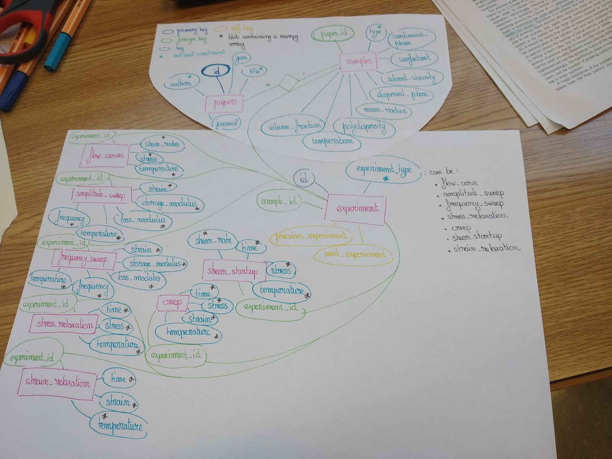

[](https://github.com/rheopy/rheodata#readme)

# rheodata 📊

**Curated rheology datasets — for training, simulation, and benchmarking.**

"What's the typical rheology of a microgel suspension? Linear polymer? concentrated emulsion?"
"What's the typical rheology of a shampoo? conditioner? hand cream? 

While a lot of data are available they are not always readily available and sometimes miss some of the metadata required to make them useful

`rheodata` is a pip-installable library of experimental rheology datasets
Every dataset carries its **provenance** (native instrument values vs digitised from a
published figure), its **measurement record** (geometry, temperature, protocol, units), and its
**citation** (community source or paper + DOI). The data are provided with a declared schema to allow simple use.

What can I do with it?

🔍 **Discover** — `rheodata.search(material="carbopol", experiment="flow_curve")`
📖 **Inspect** — `rheodata.info(id)` prints material, paper + clickable DOI, figure, measurement, samples
📦 **Load** — `rheodata.load(id)` gives a tidy DataFrame plus the full metadata dict
📈 **Plot** — `rheodata.plot(id)` draws the experiment-appropriate figure (twin-axis flow curves, G′/G″ sweeps, …)
🔧 **Fit** — `rheodata.to_rheofit(id, sample)` hands a flow curve to [rheofit](https://github.com/rheopy/rheofit) in exactly the shape it expects

## Quickstart

```bash
pip install rheopy-rheodata
```

```python
import rheodata

rheodata.list()                                   # every dataset, one row each
rheodata.search(material="carbopol")              # substring filters, case-insensitive
rheodata.search(experiment="flow_curve", tag="yield-stress")
rheodata.search(query="wormlike micelles")        # title / description / material

rheodata.info("caggioni_pg_carbopol_2pct")                 # readable summary + DOI link

ds = rheodata.load("caggioni_pg_carbopol_2pct")
ds.df.head()                                      # tidy data
ds.meta["measurement"]                            # type, geometry, temperature, protocol

fig = rheodata.plot("caggioni_pg_carbopol_2pct")           # one curve per sample
fig.savefig("caggioni_pg_carbopol_2pct.png")

fit_df = rheodata.to_rheofit("caggioni_pg_carbopol_2pct", sample="carbopol_2pct")
# → DataFrame with "Shear rate / 1/s" and "Stress / Pa", x sorted ascending
```

The CLI mirrors the API:

```bash
rheodata list
rheodata search --material Carbopol --experiment flow_curve
rheodata info caggioni_pg_carbopol_2pct
rheodata install-skill            # install the data-discovery agent skill
```

## How a dataset is stored

Each dataset is a directory `rheodata/datasets/<id>/` with two files:

- **`dataset.yaml`** — title, description, material, source paper + DOI, figure, provenance
  origin, measurement (type, geometry, temperature, details, protocol), the sample table,
  the `columns:` mapping (csv headers may carry units), and tags.
- **`data.csv`** — tidy data: one row per measurement point, column names from the yaml.

On import, the registry validates every dataset: required metadata keys, DOI shape
(`^10\.\S+/\S+`), csv columns matching the yaml, numeric x sorted ascending per sample, no
NaNs in x/y, and sample ids matching the metadata. A dataset that fails validation fails
loudly, naming the dataset — corrupt data never loads silently.

The layout implements the original schema sketch — paper → sample → experiment → data —
drawn up when the project started in 2021:



## Contributing

New datasets are curated through the GitHub issue workflow: open an issue on the
[rheodata repository](https://github.com/rheopy/rheodata) with the source paper or data file
and the proposed metadata. See `docs` (link below) for the contributor guide.

## Documentation

Full documentation lives at the [rheodata docs site](https://github.com/rheopy/rheodata#readme)
(wired up separately) — including the dataset schema reference, the contributor guide, and the
API reference.

## License

MIT — see [LICENSE](LICENSE).
